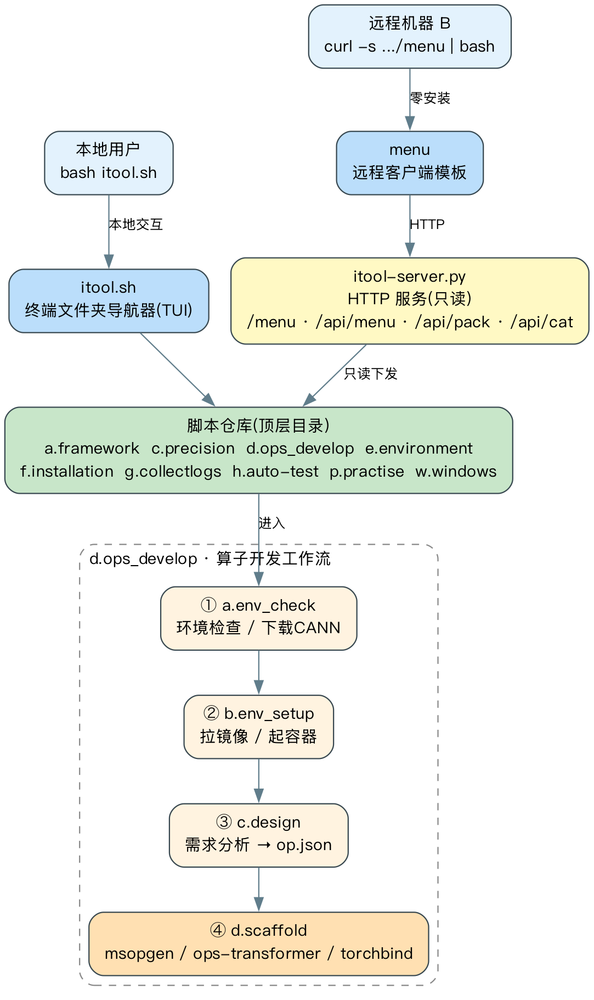

# itool — 昇腾 / 大模型开发运维工具箱

一套面向昇腾（Ascend）NPU 与 AI 大模型开发、运维、算子开发的**纯终端交互式工具箱**。把成百上千个脚本按「目录树 + 可执行 `run.sh`」组织起来，既能本机交互点选执行，也能通过一个零安装的 HTTP 客户端在远程机器上一键拉取并本地执行。

- 本地：终端文件夹导航器 `itool.sh`
- 远程：`itool-server.py` 托管菜单/脚本，客户端 `curl | bash` 零安装
- 目录约定：`字母.名称` 命名，按前缀排序，叶子目录放 `run.sh`

> 📖 具体操作手册（照抄就能跑）见 [**USAGE.md**](USAGE.md)。

---

## 目录结构

```
itool/
├── itool.sh            本地 TUI 文件夹导航器
├── itool-server.py     HTTP 服务端(只读: 菜单/打包/预览)
├── menu                远程客户端模板(curl | bash)
├── server.sh           服务启动脚本(自动生成临时 token)
├── a.framework         训练/推理框架部署(MindSpeed-LLM/MM、Llama-Factory、vllm/omni/mindiesd、部署服务)
├── b.performance       性能(预留)
├── c.precision         精度对齐(compare.py)
├── d.ops_develop       算子开发工作流(★ 详见下文)
├── e.environment       环境: 版本采集/服务器设置/OS 配置/日志级别/环境变量
├── f.installation      安装: Docker/Python/CANN/torch/triton/tilelang/mamba/gcc/编码工具
├── g.collectlogs       日志采集
├── h.auto-test         自动化测试(ascend-dmi/ais-bench/test_api)
├── p.practise          AI 第一性原理学习实验(141 个)
└── w.windows           WSL 安装
```

---

## 项目流程图

```mermaid
flowchart TB
    L[本地用户<br/>bash itool.sh] --> T[itool.sh<br/>终端文件夹导航器 TUI]
    R[远程机器 B<br/>curl -s .../menu | bash] --> C[menu<br/>远程客户端模板]
    C --> S[itool-server.py<br/>HTTP 服务 只读<br/>/menu /api/menu /api/pack /api/cat]
    T --> REPO
    S --> REPO
    REPO[脚本仓库 顶层目录<br/>a.framework · c.precision · d.ops_develop · e.environment<br/>f.installation · g.collectlogs · h.auto-test · p.practise · w.windows]
    REPO --> S1
    subgraph OPS[d.ops_develop 算子开发工作流]
        direction TB
        S1[① a.env_check<br/>环境检查 / 下载CANN] --> S2[② b.env_setup<br/>拉镜像 / 起容器] --> S3[③ c.design<br/>需求分析 → op.json] --> S4[④ d.scaffold<br/>msopgen / ops-transformer / torchbind]
    end
```



---

## 快速开始

### 1. 本地使用

```bash
cd itool
bash itool.sh          # 直接运行(退出后提示跳转路径)
# 或
source itool.sh        # source 运行, 退出后自动留在所选目录
```

交互按键：
- `↑` / `↓` 移动光标
- 字母 / 数字 快速跳转并进入对应目录（如按 `d` 进入 `d.ops_develop`）
- `Enter` 进入目录 / 执行 `run.sh`（每个叶子目录的选项 `0`）
- `Backspace` 返回上一层，`*` 回根目录，`ESC` 退出

### 2. 远程使用（服务器 A 托管，机器 B 零安装执行）

在服务器 A 上：

```bash
cd itool
export ITOOL_PASSWORD='your-password'   # 或 export ITOOL_PASSWORD_FILE=/path/to/pw
bash server.sh                          # 启动 HTTP 服务, 打印 6 位临时 token
```

在任意机器 B 上：

```bash
# 方式一: 密码登录(交互)
curl -s http://<server-A>:5170/menu | bash

# 方式二: 用 server.sh 打印的临时 token 跳过密码
curl -s http://<server-A>:5170/menu | ITOOL_TOKEN=888888 bash

# 方式三: 手动指定服务器
ITOOL_SERVER=http://<server-A>:5170 bash menu
```

> 说明：服务端只读，**绝不代跑**。`run.sh` 始终在发起请求的本地机器上执行（下载打包目录后本地运行）。

### 3. HTTP API

| 接口 | 说明 |
|---|---|
| `GET /menu` | 客户端脚本（自动注入 `SERVER_URL`） |
| `POST /api/login` | 密码或临时 token 登录，换取会话 token |
| `GET /api/menu?path=...` | 菜单结构（制表符分隔，免 jq） |
| `GET /api/pack?path=...` | 打包下载 `run.sh` 所在目录（tar.gz） |
| `GET /api/cat?path=...` | 预览 `run.sh` 内容 |

---

## 算子开发工作流 `d.ops_develop`

面向场景：**在客户机器上开发算子，或基于算子源码做改造**。按四步推进，每步都是独立 `run.sh`，可单独执行。

```
d.ops_develop/
├── a.env_check/                      ① 环境检查
│   ├── a.check_env/run.sh            先打印环境变量, 再检查 TOOLKIT/OPP/torch/torch_npu/pybind/cmake/gcc, 给修复建议
│   └── b.download_cann/run.sh        自动下载 CANN 包(toolkit + kernel), 支持 CHECK_ONLY 探测
├── b.env_setup/                      ② 环境搭建
│   ├── a.pull_vllm_ascend/run.sh     用户指定 CANN 版本 → 拉取 vllm-ascend 镜像
│   └── b.run_container/run.sh        自动枚举 /dev/davinci* → 实例化容器
├── c.design/                         ③ 算子设计需求分析
│   └── a.op_spec/run.sh              交互收集(功能/数据类型/典型shape) → 生成 op.json + op_spec.md
└── d.scaffold/                       ④ 算子脚手架
    ├── a.msopgen/run.sh              基于 msopgen(轻量) 生成算子工程
    ├── b.ops_transformer/run.sh      拉取 ops-transformer(完善) 源码 + 编译指导
    └── c.torchbind/run.sh            torchbind(CPU+NPU) / vllm_ascend 接入工程
```

### 完整示例

```bash
# ① 检查环境(输出环境变量 + 组件清单 + 修复建议)
bash d.ops_develop/a.env_check/a.check_env/run.sh

# ① 下载 CANN(先探测 URL, 再正式下载)
CANN_VERSION=8.1.RC1 CHIP=910b ARCH=x86_64 CHECK_ONLY=1 \
  bash d.ops_develop/a.env_check/b.download_cann/run.sh
CANN_VERSION=8.1.RC1 CHIP=910b ARCH=x86_64 \
  bash d.ops_develop/a.env_check/b.download_cann/run.sh

# ② 拉镜像 + 起容器(镜像 tag 形如 8.1.rc1-910b-ubuntu22.04-py3.10)
CANN_VERSION=8.1.rc1 CHIP=910b bash d.ops_develop/b.env_setup/a.pull_vllm_ascend/run.sh
bash d.ops_develop/b.env_setup/b.run_container/run.sh cann-910b:8.1.rc1 my_ascend

# ③ 需求分析 → 生成 op.json / op_spec.md
bash d.ops_develop/c.design/a.op_spec/run.sh

# ④ 生成工程
bash d.ops_develop/d.scaffold/a.msopgen/run.sh op.json        # msopgen 轻量
bash d.ops_develop/d.scaffold/b.ops_transformer/run.sh        # ops-transformer 完善
bash d.ops_develop/d.scaffold/c.torchbind/run.sh AddCustom    # torchbind 接入
```

---

## 安全约定

- **密码**：`server.sh` 不再内置明文密码，通过 `ITOOL_PASSWORD` 或 `ITOOL_PASSWORD_FILE` 提供；均未设置时首次交互设置。
- **临时 token**：每次启动 `server.sh` 自动生成 6 位 token（`token.txt`，权限 600，已 gitignore），用于跳过密码登录。
- **模型下载 token**：`a.framework/.../b.glm5/download-glm5.1.sh` 通过环境变量 `OPENMIND_HUB_TOKEN` 传入，不硬编码。
- **HTTP 不加密**：仅建议在受信网络使用；跨不可信网络请置于 HTTPS 反向代理后。
- 运行态文件 `token.txt` / `server.pid` / `server.log` / `nohup.out` / `*.log` / `kernel_meta/` / `outputs/` 均不入库。

---

## 环境要求

- 任意 Linux（服务端/客户端）；本机 macOS 亦可运行（脚本兼容 bash 3.2）
- 服务端：`python3`（标准库即可，无第三方依赖）
- 客户端：`bash` + `curl`
- 算子开发 / 安装类脚本需在昇腾环境（CANN toolkit、docker、torch_npu 等）运行

---

## 常见问题

**Q: `curl ... | bash` 提示需要交互终端？**
A: 客户端所有交互（菜单按键、`read` 输入）都显式走 `/dev/tty`，请在真实终端运行，不要用无 tty 的管道包装。

**Q: 服务端启动失败，日志 `BrokenPipeError`？**
A: 客户端下载中途断开导致，不影响功能；升级服务端异常处理或重试即可。

**Q: CANN 下载 403？**
A: 公网源对部分对象需要授权。可用 `CANN_BASE_URL` 覆盖为内网镜像，或先 `CHECK_ONLY=1` 探测 URL 是否可达。

**Q: `itool.sh` 提示 `./isetenv.sh` 不存在？**
A: 已加守卫，不阻塞运行。如需自动加载私有环境变量，把 `e.environment/e.setenvs/setenvs.sh` 拷到仓库根目录命名为 `isetenv.sh` 即可。
